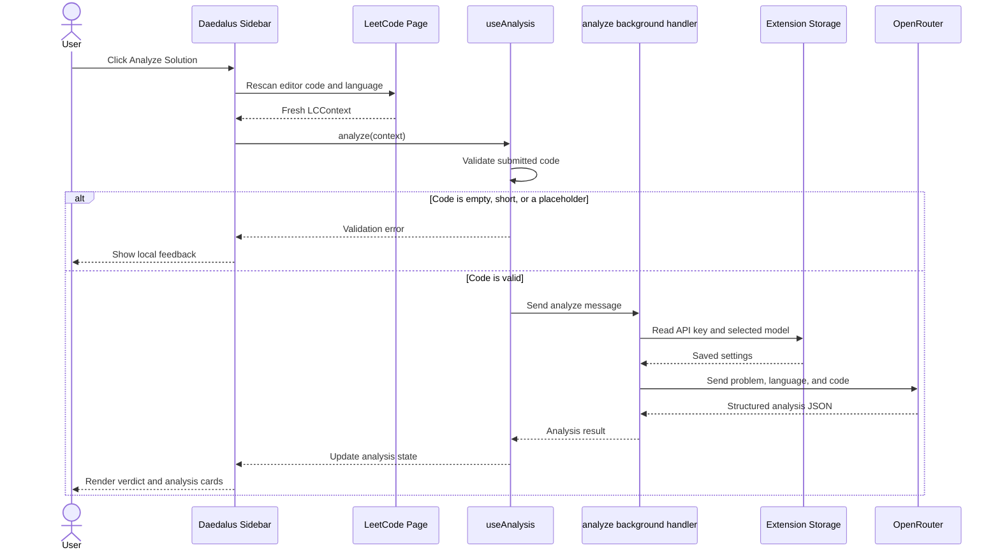
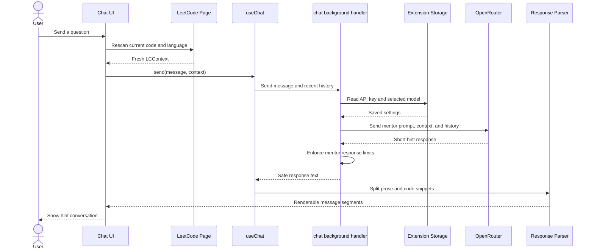

# Daedalus
AI-Powered LeetCode Mentor — Hints, Not Solutions

## Overview
Daedalus is a Chrome extension that acts as a real-time coding mentor while you solve LeetCode problems. It reads the active problem, inspects your editor code, answers general programming questions, and provides structured analysis with contextual guidance — without ever giving away a complete solution.

> 🧠 **Philosophy:** Daedalus is built around a core principle — **guided learning over instant answers.** Every response is designed to push you toward understanding the solution yourself.

---

## Problem Statement
LeetCode is one of the most widely used platforms for competitive programming and technical interview preparation, but the learning loop is broken. When stuck, developers either stare at the problem indefinitely, losing momentum, or immediately look up the editorial and copy a solution without internalizing the approach. Neither path builds lasting problem-solving skills.

AI chatbots like ChatGPT can help, but they have the opposite problem — they eagerly produce full solutions with no restraint, defeating the purpose of practice. There is no tool that sits *between* a blank screen and a full answer: something that reads your code in real time, understands what you're attempting, and nudges you in the right direction with a well-placed hint.

---

## Solution
Daedalus bridges the gap between struggle and surrender. It injects a dockable sidebar directly onto LeetCode problem pages that understands your current problem context — the problem statement, your chosen language, and your in-progress code — and routes everything through an LLM with strict mentor guardrails. The LLM is instructed to review, critique, explain syntax or concepts, and answer unrelated programming questions, but **never** to produce a working solution. Analysis responses are structured JSON with verdicts, complexity assessments, and alternative approach hints. Chat responses stay concise while allowing short examples when they help.

---

## Key Features

### Code Analysis
- **Structured Verdict System:** Every analysis returns a clear verdict — **Correct**, **Wrong**, or **Partial** — so you know exactly where you stand.
- **Intuition Review:** Evaluates your conceptual approach with a summary, key insight, and "why it works" explanation.
- **Method Assessment:** Identifies the algorithm name and category, with numbered implementation steps.
- **Complexity Breakdown:** Reports time and space complexity with explanations, plus a note on whether an optimal solution exists.
- **Code Style Scoring:** Scores readability, efficiency, structure, and best practices on a 0–10 scale, with specific strengths and improvements listed.
- **Key Concepts:** Surfaces the foundational data structures and algorithms your solution relies on.
- **Alternative Comparison:** Table of alternative approaches showing time/space complexity and feasibility — conceptual hints only, never full implementations.

### Mentor Chat
- **Context-Aware Conversations:** Every chat message includes the latest problem statement, your current language, and freshly re-scanned editor code — the mentor always sees what you see.
- **General Programming Q&A:** You can ask syntax, STL, language-feature, algorithm, or debugging questions even when they are not directly related to the current LeetCode problem.
- **Conversation History:** Maintains up to the last 6 messages for multi-turn dialogue so the mentor can build on previous hints.
- **Triple-Layer Guardrails:** Pre-filter blocks full-solution requests before any API call. System prompt allows general programming help while refusing complete LeetCode solutions. Post-processing via `enforceMentorResponse()` cleans markdown/LaTeX artifacts and rejects oversized code dumps.
- **Code Block Rendering:** LLM responses are parsed through a markdown processor that separates prose from code, rendering syntax-highlighted code blocks with line numbers and one-click copy.

### LeetCode Integration
- **Automatic Page Scraping:** Extracts problem title, description, language, and code directly from the LeetCode DOM — no manual copy-paste required.
- **Multi-Strategy Editor Detection:** Code extraction tries 5 strategies in order — Monaco `textarea.inputarea` (preferred, captures full content even with virtualized lines), Monaco rendered `.view-lines`, CodeMirror v5 `.CodeMirror-code`, CodeMirror v6 `.cm-editor .cm-content`, and generic `pre.CodeMirror-line` — so it works across LeetCode's editor versions.
- **Async Retry with Progressive Delays:** LeetCode loads its Monaco editor asynchronously. Daedalus retries extraction at `[0, 400, 1200, 2500]ms` delays, and preserves the last known good code if a re-scan returns empty.
- **Language Normalization:** Maps 12+ abbreviations (`js`, `ts`, `py`, `cpp`, `rb`, `kt`, `rs`, `cs`, etc.) and scans the page's language selector buttons against 19 known language names. Default fallback: `C++`.
- **Fresh Scans on Every Action:** The editor is re-scanned (with an 80ms keystroke-commit delay) before every analysis and chat message, so the LLM always sees your latest code — not a stale snapshot.

### User Interface
- **Dockable Sidebar:** A glassmorphic panel injected directly onto LeetCode pages via Plasmo content script with Shadow DOM isolation, ensuring zero CSS conflicts with the host page.
- **Floating Toggle Button:** A pulsing ⚡ button at the bottom-right corner (`z-index: 2147483647`) with float and glow animations toggles the sidebar open/closed.
- **Animated Tab Navigation:** Smooth sliding orange indicator across Analyze, Chat, and Settings tabs.
- **Shimmer Buttons:** Buttons with a sweeping translucent white stripe animation (`2.5s` loop with skew transform) for visual premium feel.
- **Glow Badges:** Status indicator badges with animated pulsing dots (green for valid API key, grey for invalid).
- **Canvas Light Rays:** Decorative background rendered on `<canvas>` using `requestAnimationFrame` — 7 triangular rays with orange-to-transparent gradients, slow sinusoidal rotation. Handles DPR scaling and `ResizeObserver` for responsive sizing.
- **Typing Indicator:** Three-dot bounce animation with staggered delays while waiting for LLM responses.
- **Dark Theme:** Fully dark glassmorphic design that blends with LeetCode's dark mode.

### Extension Popup
- **Standalone Access:** The toolbar popup provides API key management and model selection outside the sidebar.
- **Remote Panel Trigger:** Detects if the active tab is a LeetCode problem and shows an "⚡ Open Analyzer" button that uses `chrome.scripting.executeScript` to programmatically click the floating button inside the content script's Shadow DOM.
- **API Key Management:** Securely save and mask your OpenRouter API key with `sk-or-` prefix validation.
- **Model Selection:** Browse and select from available free OpenRouter models with one click. Falls back to 4 curated models (NVIDIA Nemotron 3, Google Gemma 4 26B/31B, OpenRouter Free Router) when the API is unavailable.

---

## System Architecture

```
LeetCode Page (DOM)
        |
        v
Content Script (panel.tsx)
  - Scrapes problem, code, language
  - Renders sidebar UI
        |
        v
Plasmo Messaging Layer
  - sendToBackground()
        |
        v
Background Service Worker
  - analyze.ts handler
  - chat.ts handler
  - models.ts handler
        |
        +---- @plasmohq/storage
        |       (API key, selected model)
        |
        v
OpenRouter API
  - Chat Completions
  - Model Listing
        |
        v
Response Processing
  - JSON extraction with 3-layer fallback
  - Mentor guardrails enforcement
  - Markdown → code block parsing
        |
        v
React UI Components
  - AnalysisCards / CodeStyleCard
  - ChatPanel / CodeBlock
  - SettingsPanel
```

---

## Technology Stack

| Layer | Technology |
|-------|------------|
| **Framework** | Plasmo (v0.90.5) |
| **UI Library** | React (v18) |
| **Language** | TypeScript (v5) |
| **Build Tool** | Vite (v5) |
| **Styling** | Shared CSS (`src/styles.css`) |
| **Extension Storage** | `@plasmohq/storage` |
| **Extension Messaging** | `@plasmohq/messaging` |
| **LLM Provider** | OpenRouter API |
| **Default Model** | `nvidia/nemotron-3-nano-30b-a3b:free` |
| **Target Browser** | Chrome (Manifest V3) |

---

## Styling Architecture

All visual styling is maintained in one file:

```text
src/styles.css
```

Components use descriptive class names and do not contain inline `style` props or component-level `<style>` tags. The stylesheet contains the color system, layouts, component states, animations, popup styles, and sidebar styles.

The same file is loaded in both extension surfaces:

- `src/popup.tsx` imports `styles.css` directly for the toolbar popup.
- `src/contents/panel.tsx` loads the stylesheet with Plasmo's `data-text:` loader and returns it through `getStyle()`. This injects the CSS into the content script's shadow root while preserving isolation from LeetCode's styles.

State-dependent visuals use modifier classes such as `sidebar--minimized`, `tab--active`, and `score-badge--high`. Code-quality values use native `<progress>` elements, avoiding dynamically generated inline widths.

---

## Analysis Engine

### How It Works

When you click **Analyze**, Daedalus performs these steps:

1. **Re-scan:** The content script re-reads the LeetCode DOM for the latest editor code, language, and problem statement.
2. **Validate:** `validateCode()` filters out blank lines, comments, wrappers, access labels, bare braces, class declarations, and function signatures. It rejects empty editors, empty LeetCode stubs, placeholder text, and submissions with too little actual implementation logic.
3. **Prompt Construction:** The problem, language, and code are injected into a structured prompt template that demands a specific JSON response format.
4. **LLM Request:** The prompt is sent to OpenRouter's chat completions endpoint via the background service worker.
5. **JSON Extraction:** The response is parsed through a 3-layer fallback pipeline:

| Layer | Strategy |
|-------|----------|
| **1. Direct Parse** | Strip markdown fences, attempt `JSON.parse()` |
| **2. Regex Block** | Extract the first `{...}` JSON block via regex |
| **3. Field Extraction** | Regex-extract individual fields (`verdict`, `intuition`, etc.) |

6. **Normalization:** Missing fields are populated with safe defaults to guarantee the UI always has complete data.
7. **Rendering:** The result is rendered across verdict banner, intuition card, method card, complexity display, code quality list, and alternatives section.

### Analysis Response Structure

```json
{
  "verdict": "Short one-line assessment of the solution",
  "intuition": {
    "summary": "High-level approach overview",
    "keyInsight": "The critical insight that makes this work",
    "whyItWorks": "Explanation of correctness"
  },
  "method": {
    "name": "Algorithm name",
    "category": "Category (e.g., Greedy, DP, Graph)",
    "steps": ["Step 1", "Step 2", "Step 3"]
  },
  "concepts": [
    { "name": "Hash Map", "description": "Used for O(1) lookups", "icon": "🗂" }
  ],
  "complexity": {
    "time": "O(n)",
    "timeExplanation": "Single pass through the array",
    "space": "O(n)",
    "spaceExplanation": "Hash map stores up to n elements",
    "optimal": true,
    "optimalNote": "This is the optimal solution"
  },
  "codeStyle": {
    "readability": 7.2,
    "efficiency": 6.8,
    "structure": 7.6,
    "bestPractices": 7,
    "overallScore": 7.2,
    "strengths": ["Clean variable naming"],
    "improvements": ["Add early return for edge cases"]
  },
  "comparison": {
    "approaches": [
      { "name": "Brute Force", "time": "O(n²)", "space": "O(1)", "feasible": true },
      { "name": "Two Pointers", "time": "O(n)", "space": "O(1)", "feasible": false }
    ]
  }
}
```

Every field is defensively normalized through `asText()`, `asList()`, `asScore()`, and `asRecord()` coercion helpers — missing fields are populated with safe defaults so the UI always renders completely.

### Verdict Classification

| Verdict | Meaning |
|---------|---------|
| **Correct** | The solution is logically sound and handles edge cases |
| **Partial** | The approach is on the right track but has gaps or bugs |
| **Wrong** | The approach is fundamentally flawed or produces incorrect results |

---

## Chat System

### Mentor Conversation Flow

Each chat turn includes the current problem, language, the latest editor code (freshly re-scanned), and up to the last 6 messages of conversation history. The system prompt explicitly instructs the LLM to behave as a coding mentor, answer unrelated programming questions directly, and use the current problem only when the user's message actually depends on it.

### Triple-Layer Guardrails

| Layer | Enforcement Point | Details |
|-------|-------------------|---------|
| **1. Pre-Filter** | Before API call | Regex detects phrases like "give me the full solution" and returns a canned refusal immediately — no tokens wasted |
| **2. System Prompt** | Behavior and formatting rules in the prompt | Answer general programming questions directly, never write a complete problem solution, avoid LaTeX, use code fences for snippets, and avoid markdown headers |
| **3. Post-Filter** | `enforceMentorResponse()` | Cleans markdown headers outside code blocks, converts LaTeX-style complexity into readable text, rejects oversized code dumps, and trims overly verbose replies |

### Message Rendering Pipeline

```
Raw LLM response
       |
       v
parseMarkdown()
  - Detect fenced code blocks (``` ... ```)
  - Detect inline code
  - Heuristic code detection (symbol density, keywords)
       |
       v
Segment[] → [text, code, text, code, ...]
       |
       v
React rendering
  - Text segments → styled paragraphs
  - Code segments → CodeBlock component (with copy button)
```

---

## Analysis Workflow



---

## Chat Conversation Workflow



---

## Mentor Guardrails

Daedalus is designed as a **learning aid**, not a solution generator:

- It does **not** provide complete working solutions.
- Chat responses are concise, but can include short syntax examples for general programming questions.
- Oversized code snippets are treated as likely solution dumps and replaced with a safer direction.
- Requests for full solutions are intercepted **before the API call** and refused with a canned response.
- Analysis responses are structured as critique (verdict + hints), not code generation.
- All LLM output passes through `enforceMentorResponse()` which cleans formatting artifacts and enforces safety limits.

---

## Project Structure

```text
daedalus/
├── assets/
│   └── icon.png                      Extension icon
├── src/
│   ├── popup.tsx                     Extension toolbar popup
│   ├── styles.css                    Shared popup and sidebar stylesheet
│   ├── chrome.d.ts                   Chrome scripting API type declarations
│   ├── background/
│   │   └── messages/
│   │       ├── analyze.ts            Analysis request handler
│   │       ├── chat.ts               Chat request handler
│   │       └── models.ts             Free model listing handler
│   ├── components/
│   │   ├── analysis/
│   │   │   ├── AnalysisCards.tsx      Verdict, intuition, method, complexity cards
│   │   │   └── CodeStyleCard.tsx     Code quality issues and suggestions
│   │   ├── chat/
│   │   │   ├── ChatPanel.tsx         Chat conversation UI
│   │   │   └── CodeBlock.tsx         Syntax-highlighted code block with copy
│   │   ├── settings/
│   │   │   └── SettingsPanel.tsx     API key and model configuration
│   │   └── ui/
│   │       ├── AnimatedTabs.tsx      Tab bar with sliding indicator
│   │       ├── FloatingButton.tsx    Sidebar toggle button
│   │       ├── GlowBadge.tsx         Animated glow badge for verdicts
│   │       ├── LightRays.tsx         Decorative background light rays
│   │       ├── ShimmerButton.tsx     Gradient shimmer button
│   │       └── TypingDots.tsx        Chat typing indicator
│   ├── contents/
│   │   └── panel.tsx                 LeetCode sidebar content script
│   ├── hooks/
│   │   ├── useAnalysis.ts            Analysis workflow state management
│   │   ├── useChat.ts                Chat conversation state management
│   │   ├── useLeetCode.ts            LeetCode DOM scraping hook
│   │   ├── useModels.ts              OpenRouter model listing hook
│   │   └── useSettings.ts            Extension settings persistence hook
│   └── utils/
│       ├── constants.ts              Prompt templates and system constants
│       ├── leetcode.ts               DOM extraction and language normalization
│       ├── markdown.ts               LLM response → text/code segment parser
│       ├── openrouter.ts             OpenRouter API client with fallback parsing
│       ├── types.ts                  Shared TypeScript type definitions
│       └── validator.ts              Client-side code validation
├── package.json
├── tsconfig.json
└── README.md
```

---

## Setup

### Prerequisites

- **Node.js** (v18+)
- **npm** (v9+)
- **Google Chrome** (or any Chromium-based browser)
- **OpenRouter API Key** — [Create one here](https://openrouter.ai/keys) (free tier available)

### Install Dependencies

```bash
npm install
```

### Development Build

```bash
npm run dev
```

Plasmo starts a development server with hot module replacement. The extension auto-reloads on code changes.

### Production Build

```bash
npm run build
```

The production extension is generated in:

```text
build/chrome-mv3-prod
```

### Package for Distribution

```bash
npm run package
```

---

## Load in Chrome

1. Open `chrome://extensions`.
2. Enable **Developer mode** (toggle in the top-right corner).
3. Click **Load unpacked**.
4. Select the `build/chrome-mv3-prod` directory.
5. Open any LeetCode problem page and refresh.

---

## Configuration

1. Create a free API key at [OpenRouter](https://openrouter.ai/keys).
2. Open Daedalus — either via the extension popup (toolbar icon) or the sidebar on a LeetCode page.
3. Navigate to the **Settings** tab.
4. Enter and save your API key.
5. Select a free model from the dropdown, or use the default (`nvidia/nemotron-3-nano-30b-a3b:free`).

> ⚠️ API keys are stored via Chrome extension storage. They are **never** committed to source code or transmitted anywhere other than OpenRouter's API endpoint.

---

## Usage

### Opening Daedalus

Navigate to any LeetCode problem URL:

```text
https://leetcode.com/problems/*
```

Click the pulsing **⚡** button in the bottom-right corner to open the sidebar. Alternatively, click the Daedalus extension icon in the toolbar and use the **⚡ Open Analyzer** button (only visible on LeetCode problem pages).

### Analyze Tab

1. Write or modify your solution in the LeetCode editor.
2. Click **Analyze Solution**.
3. Daedalus re-scans your code, validates it, and sends it to the LLM.
4. Review the verdict, intuition feedback, complexity analysis, code quality issues, and alternative approach hints.

### Chat Tab

1. Type a question about your approach or a specific concept.
2. Daedalus re-scans your editor before every message so the mentor always sees your latest code.
3. Receive short, targeted hints — never full solutions.
4. Continue the conversation for follow-up hints.

### Settings Tab

- **API Key:** Enter and save your OpenRouter API key.
- **Model:** Select from available free models or refresh the model list.

---

## Chrome Permissions

| Permission | Purpose |
|------------|---------|
| `storage` | Persist API key and selected model across sessions |
| `activeTab` | Access the current LeetCode tab for DOM scraping |
| `scripting` | Execute content scripts to extract editor state |
| `host_permissions: leetcode.com` | Inject sidebar onto LeetCode pages |
| `host_permissions: openrouter.ai` | Make API requests to OpenRouter |

---

## Notes

- LeetCode loads its Monaco editor asynchronously. Daedalus retries the initial scan at progressive delays (`0ms`, `400ms`, `1200ms`, `2500ms`) and preserves the last known good code state if a re-scan returns empty.
- Free OpenRouter models can be temporarily rate-limited. If a provider returns a `429` response, switch to another free model from the settings. Detailed error messages are provided for `401` (invalid key), `402` (billing), and `429` (rate limit) errors.
- The extension uses Plasmo's Shadow DOM isolation (`#daedalus-host`), so its styles never interfere with LeetCode's UI. The styling is centralized in `src/styles.css` and injected into the shadow root via Plasmo's `getStyle` API.
- API keys are validated client-side (`startsWith("sk-or-")`) and stored via `@plasmohq/storage`. Never commit them to the repository.
- The popup detects LeetCode tabs and can remotely trigger the sidebar via `chrome.scripting.executeScript`.

---

## Future Aspects & Roadmap

Daedalus is built to evolve into a comprehensive coding education companion. Planned improvements:

### 1. Streaming Responses
- **Real-Time Token Streaming:** Switch from buffered responses to streamed tokens for a more responsive chat experience where hints appear word by word.
- **Progressive Analysis:** Stream analysis results section by section as the LLM generates them.

### 2. Multi-Platform Support
- **Codeforces & HackerRank:** Extend DOM scraping to support other competitive programming platforms.
- **Firefox & Edge:** Port the extension to other browsers using Plasmo's cross-browser build targets.

### 3. Solution History & Progress Tracking
- **Local Analysis Archive:** Store past analyses per problem with timestamps so you can track your improvement over time.
- **Approach Journal:** Automatically log which approaches you tried and what hints you needed.

### 4. Enhanced Code Intelligence
- **Syntax-Aware Analysis:** Integrate a lightweight parser for more accurate code understanding instead of raw text analysis.
- **Test Case Generation:** Generate edge case inputs based on problem constraints to help identify bugs.

---

## License

This project is licensed under the MIT License:

```
MIT License

Copyright (c) 2026 Somesh Gorai

Permission is hereby granted, free of charge, to any person obtaining a copy
of this software and associated documentation files (the "Software"), to deal
in the Software without restriction, including without limitation the rights
to use, copy, modify, merge, publish, distribute, sublicense, and/or sell
copies of the Software, and to permit persons to whom the Software is
furnished to do so, subject to the following conditions:

The above copyright notice and this permission notice shall be included in all
copies or substantial portions of the Software.

THE SOFTWARE IS PROVIDED "AS IS", WITHOUT WARRANTY OF ANY KIND, EXPRESS OR
IMPLIED, INCLUDING BUT NOT LIMITED TO THE WARRANTIES OF MERCHANTABILITY,
FITNESS FOR A PARTICULAR PURPOSE AND NONINFRINGEMENT. IN NO EVENT SHALL THE
AUTHORS OR COPYRIGHT HOLDERS BE LIABLE FOR ANY CLAIM, DAMAGES OR OTHER
LIABILITY, WHETHER IN AN ACTION OF CONTRACT, TORT OR OTHERWISE, ARISING FROM,
OUT OF OR IN CONNECTION WITH THE SOFTWARE OR THE USE OR OTHER DEALINGS IN THE
SOFTWARE.
```
